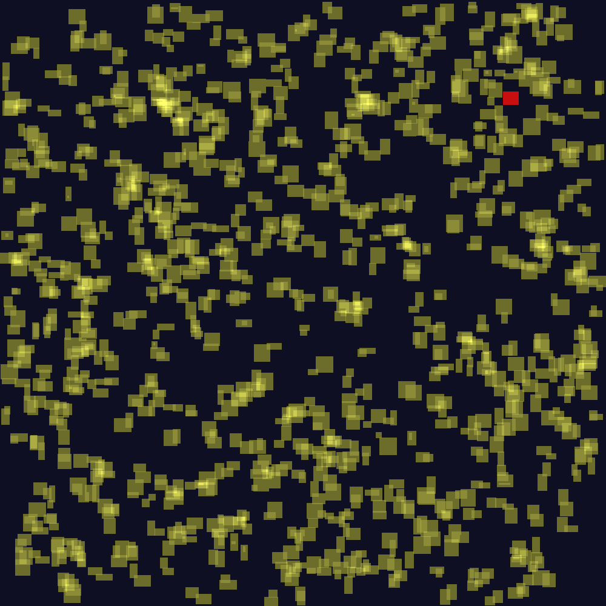
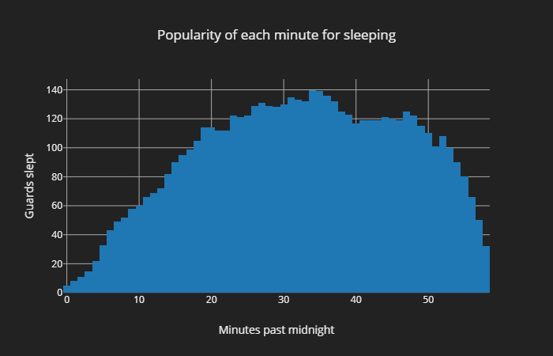
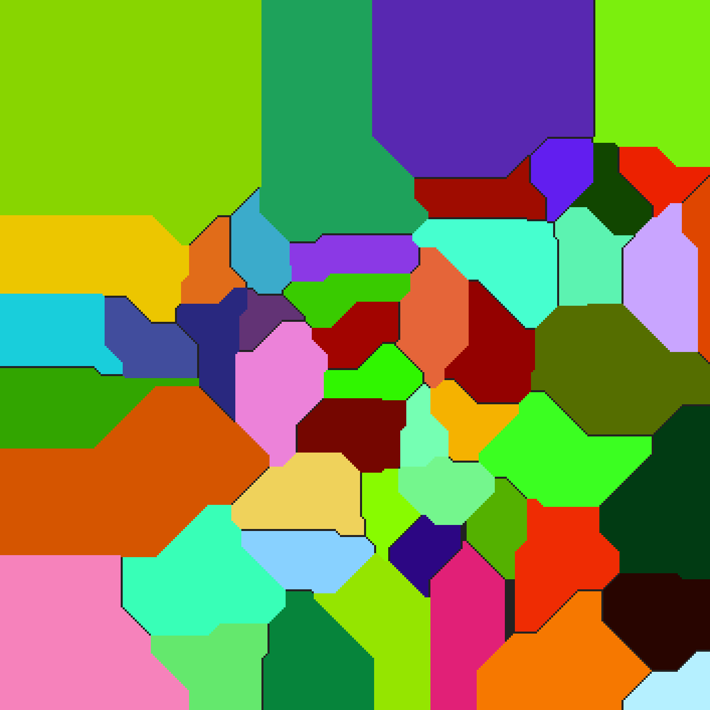
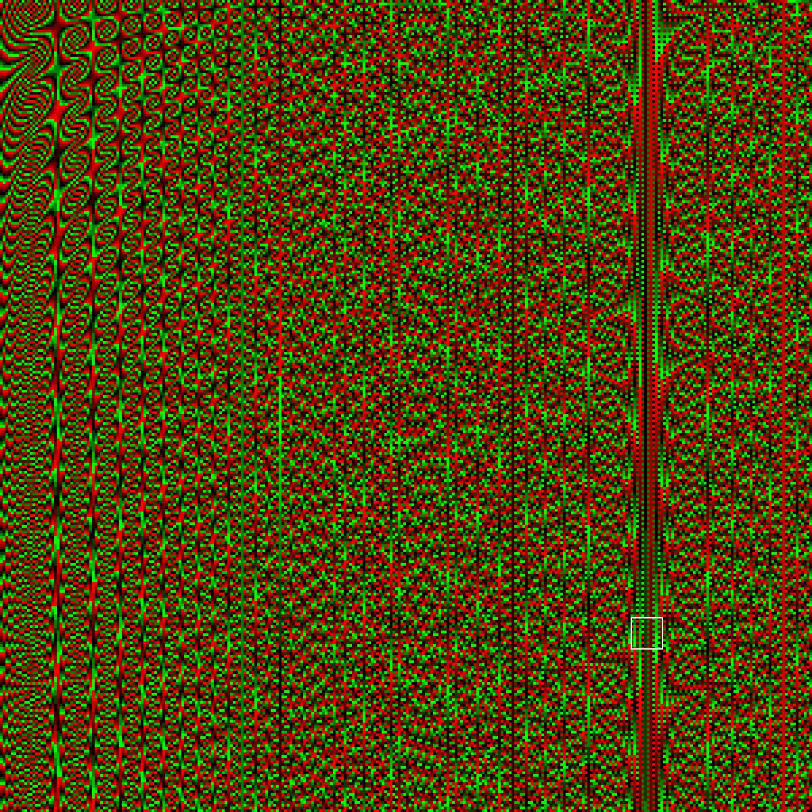
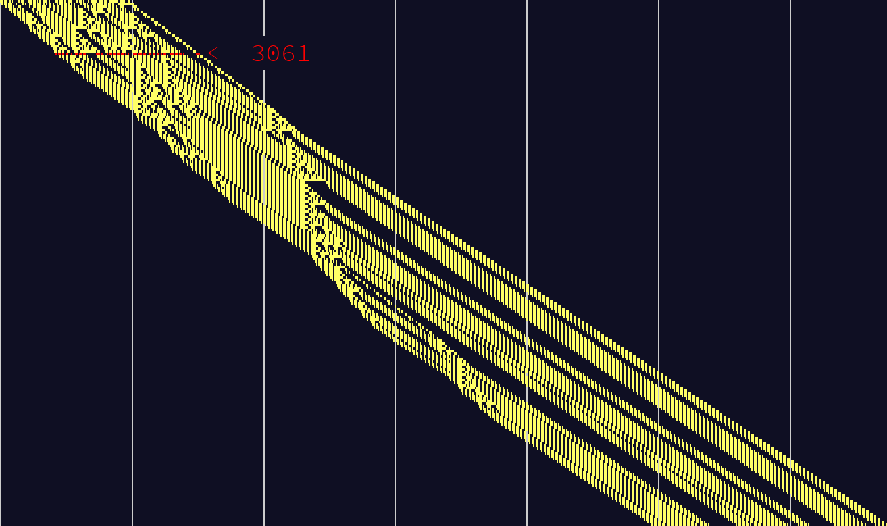

# Advent of Code 2018

A visualization of Day 3:



[Link to a graph of day 4](https://gist.github.com/drewtato/891faa8b9603bc0ffd67a90faa16ecfc) (you'll probably have to download it since htmlpreview.github.io doesn't want to deal with this gist)



A visualization of day 6:



A visualization for day 11:



A visualization for day 12:



I made a [video](https://www.youtube.com/watch?v=KF3GrJb1ACE) for day 17. Here's a small version:


Stats:

```text
      -------Part 1--------   -------Part 2--------
Day       Time  Rank  Score       Time  Rank  Score
 17   04:22:12   696      0   04:23:30   680      0
 16   00:52:57   570      0   01:11:22   398      0
 15   23:31:08  2044      0   23:50:51  1873      0
 14   00:19:38   509      0   01:17:19  1027      0
 13   01:26:40   837      0   01:50:53   706      0
 12   00:51:54  1000      0   01:09:13   668      0
 11   00:17:41   696      0   00:29:36   406      0
 10   00:35:03   594      0   00:36:36   589      0
  9   00:31:00   447      0   00:31:48   129      0
  8   01:26:54  1802      0   02:01:46  1784      0
  7   01:24:48  1968      0   02:36:30  1688      0
  6   01:59:57  2040      0   02:09:00  1795      0
  5   00:23:03  1309      0   00:32:31  1021      0
  4   00:42:32   823      0   00:48:48   773      0
  3   00:33:51  1630      0   00:36:27  1213      0
  2   00:05:14   249      0   00:11:00   226      0
  1   00:03:43   550      0   00:12:32   447      0
```