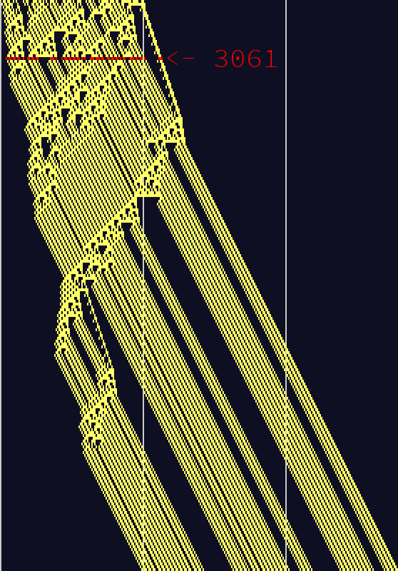

# Advent of Code 2018

This is a repository of my solutions to [Advent of Code 2018](https://adventofcode.com/2018) by [Eric Wastl](https://twitter.com/ericwastl). All of the included code was written completely by me, with some help from the [subreddit](https://www.reddit.com/r/adventofcode/) and also friends on Discord. Of course, some imported packages were not written by me, but I tried to keep those relatively infrequent. Exceptions were the Python Standard Library, which I used as much as possible, and [Pillow](https://python-pillow.org/) for creating the images.

I was able to finish almost all of the days on the day they came out, and finished the whole thing in January instead of October like last year. Huge improvement! 😝

Some of the days require manual intervention/interpretation or are input specific (like day 10), but I only did this when there was a large time advantage. I did fix day 24 to give an answer without intervention, which was one of the most interesting ones because of the infinite loop.

My favorite ones were probably the cellular automata ones (visualizations below).

I'm hoping by next year I'll have a lot more experience with this programming in general and will be able to make it on the leaderboard for once. Happy coding to everyone else; see you next year!

## Visualizations

A visualization of Day 3:


[Link to a graph of day 4](https://gist.github.com/drewtato/891faa8b9603bc0ffd67a90faa16ecfc) (you'll probably have to download it since htmlpreview.github.io doesn't want to deal with this gist)


A visualization of day 6:


A visualization for day 11:


A visualization for day 12:



I made a [video](https://www.youtube.com/watch?v=KF3GrJb1ACE) for day 17. Here's a small version:


I made a few gifs for day 18. Here's one:


The maze of day 20:


Stats:

```text
      -------Part 1--------   -------Part 2--------
Day       Time  Rank  Score       Time  Rank  Score
 25       >24h  3555      0       >24h  2341      0
 24   03:50:23   590      0   04:51:53   587      0
 23   01:45:45   967      0       >24h  2850      0
 22   01:12:30   693      0       >24h  2953      0
 21   01:22:27   552      0   01:39:40   279      0
 20   04:09:06   712      0   04:14:07   651      0
 19   00:22:20   316      0   02:16:31   557      0
 18   00:37:43   731      0   01:06:25   703      0
 17   04:22:12   696      0   04:23:30   680      0
 16   00:52:57   570      0   01:11:22   398      0
 15   23:31:08  2044      0   23:50:51  1873      0
 14   00:19:38   509      0   01:17:19  1027      0
 13   01:26:40   837      0   01:50:53   706      0
 12   00:51:54  1000      0   01:09:13   668      0
 11   00:17:41   696      0   00:29:36   406      0
 10   00:35:03   594      0   00:36:36   589      0
  9   00:31:00   447      0   00:31:48   129      0
  8   01:26:54  1802      0   02:01:46  1784      0
  7   01:24:48  1968      0   02:36:30  1688      0
  6   01:59:57  2040      0   02:09:00  1795      0
  5   00:23:03  1309      0   00:32:31  1021      0
  4   00:42:32   823      0   00:48:48   773      0
  3   00:33:51  1630      0   00:36:27  1213      0
  2   00:05:14   249      0   00:11:00   226      0
  1   00:03:43   550      0   00:12:32   447      0
```